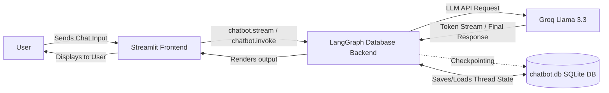
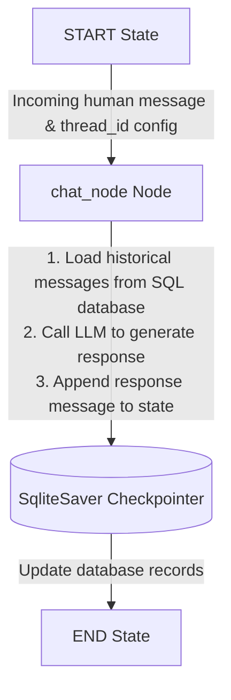

# 🧠 LangGraph ChatBot (Streamlit + Groq + SQLite) 🤖✨

Welcome to the **LangGraph ChatBot** repository! This project demonstrates how to build a highly responsive, stateful conversational AI chatbot using **LangGraph** for multi-turn dialogue management, **Groq (`llama-3.3-70b-versatile`)** for lightning-fast inference, **SQLite** for database-backed checkpointing, and **Streamlit** for a polished, modern web UI.

It supports three frontend setups:
1.  **Streaming database-backed UI** (`streamlit_frontend_database.py`) - **(Recommended / New)**
2.  **Streaming memory-only UI** (`streamlet_frontend_streaming.py`)
3.  **Static memory-only UI** (`streamlit_frontend.py`)

---

## 🚀 Key Features

*   **💾 Database-Backed Persistence**: Integrated SQLite Saver checkpointer (`SqliteSaver`) to save conversational state permanently. Conversations survive server restarts!
*   **⚡ Real-Time Message Streaming**: Renders response tokens dynamically as they are generated by Groq using Streamlit's typewriter-like streaming output.
*   **🔁 Multi-Turn Conversation Continuity**: Retains full chat context across turns utilizing LangGraph's native checkpointing system.
*   **📂 Multi-Conversation Thread Switcher**: Generates and lists unique `thread_id` sessions in the sidebar, allowing you to jump back and forth between different chats.
*   **🧠 LangGraph State Machine**: Leverages a structured, node-based state flow (`StateGraph`) with a state reducer (`add_messages`) to manage memory deterministically.
*   **🎨 Premium Dark Mode Aesthetics**: Uses custom styled layouts, custom CSS injections, sidebar management, and custom headers/footers for a beautiful user experience.

---

## 🏗️ Architecture & Flow Diagrams

### 1️⃣ System Interaction Flow (Database-Backed)
This diagram shows how the user, the Streamlit frontend, the LangGraph database backend, and the LLM API communicate:



### 2️⃣ LangGraph Node-Edge Logic (Backend Graph)
This diagram illustrates the state graph definition inside the compiled chatbot:



---

## 🗄️ Database Integration: How SQLite Saver works

To persist conversational threads permanently, we added SQLite support using LangGraph's `SqliteSaver` checkpointer.

### 1. The Role of the Checkpointer
In LangGraph, the **checkpointer** acts as a state persistence database layer. 
*   **Saving State**: Every time a node completes execution (like `chat_node`), the checkpointer captures a snapshot of the graph's current state (including message history) and writes it to the database.
*   **Loading State**: When a new query is sent with a specific `configurable: {thread_id: ...}` config, the checkpointer automatically intercepts it, queries the database for the last saved state belonging to that `thread_id`, and loads it back into the graph's state so the LLM has complete context.

### 2. How we did it: Backend SQLite Setup
In [langgraph_database_backend.py](file:///e:/Projects/Project1Demo/Langgraph-ChatBot/langgraph_database_backend.py), we initialize a connection to a local SQLite database file `chatbot.db` and instantiate the `SqliteSaver`:
```python
import sqlite3
from langgraph.checkpoint.sqlite import SqliteSaver

# Create SQLite database connection (allow multi-thread access)
conn = sqlite3.connect(database='chatbot.db', check_same_thread=False)

# Instantiate SQLite Saver checkpointer
checkpointer = SqliteSaver(conn=conn)

# Compile graph with the SQLite checkpointer
chatbot = graph.compile(checkpointer=checkpointer)
```

### 3. Listing Saved Threads
To allow the frontend to reload previous conversations upon startup, we created a helper function `retrieve_all_theads()` that queries the checkpointer for all unique thread IDs stored in the database:
```python
def retrieve_all_theads():
    all_threads = set()
    # List all checkpoints stored in the SQLite database
    for checkpoint in checkpointer.list(None):
        all_threads.add(checkpoint.config['configurable']['thread_id'])
    return list(all_threads)
```

---

## 🧩 The `thread_id` & Multi-Conversation Frontend

In [streamlit_frontend_database.py](file:///e:/Projects/Project1Demo/Langgraph-ChatBot/streamlit_frontend_database.py), the thread switching and load logic runs on top of SQLite storage:

### 1. Initializing Thread List from Database
On startup, the Streamlit frontend populates its list of previous conversation threads directly from `chatbot.db`:
```python
if 'chat_threads' not in st.session_state:
    st.session_state['chat_threads'] = retrieve_all_theads()
```

### 2. Loading Conversation History
When the user switches to a previous thread in the sidebar, we retrieve its saved messages directly from the SQLite database via the checkpointer:
```python
def load_conversation(thread_id):
    state = chatbot.get_state(config={'configurable': {'thread_id': thread_id}})
    return state.values['messages']
```

---

## 🌊 Real-Time Streaming Output

Instead of making the user wait for the full assistant message (which can take several seconds), we stream tokens live.

### 1. Enabling LLM-level Streaming
We initialize our Groq Chat model with streaming enabled:
```python
llm_model = ChatGroq(model="llama-3.3-70b-versatile", streaming=True)
```

### 2. Frontend Streaming Implementation
We execute the compiled graph using `chatbot.stream(...)` with `stream_mode='messages'`, which yields tuples of `(message_chunk, metadata)` as tokens arrive. We then feed this generator into Streamlit's native `st.write_stream(...)` to render it token-by-token:
```python
with st.chat_message('Assistant : '):
    ai_message = st.write_stream(
        message_chunk.content for message_chunk, metadata in chatbot.stream(
            {'messages': [HumanMessage(content=user_input)]}, 
            config=CONFIG,
            stream_mode='messages'
        )
    )
```

---

## 📁 Project Structure (Key Files)

- **[langgraph_database_backend.py](file:///e:/Projects/Project1Demo/Langgraph-ChatBot/langgraph_database_backend.py)** 🗄️ **(New)**
  * SQLite database-backed LangGraph state graph.
  * Implements the `retrieve_all_theads()` query function.
- **[streamlit_frontend_database.py](file:///e:/Projects/Project1Demo/Langgraph-ChatBot/streamlit_frontend_database.py)** 🌊 **(New / Recommended)**
  * Polished database-backed streaming frontend. Loads past threads on launch and updates conversations live in SQLite.
- **[langgraph_backend.py](file:///e:/Projects/Project1Demo/Langgraph-ChatBot/langgraph_backend.py)** 🧠
  * Legacy memory-only (`InMemorySaver`) checkpointer backend.
- **[streamlet_frontend_streaming.py](file:///e:/Projects/Project1Demo/Langgraph-ChatBot/streamlet_frontend_streaming.py)** 🖥️
  * Legacy memory-only streaming frontend.
- **[streamlit_frontend.py](file:///e:/Projects/Project1Demo/Langgraph-ChatBot/streamlit_frontend.py)** 🖥️
  * Legacy memory-only static invoke frontend.
- **[view_checkpoints.py](file:///e:/Projects/Project1Demo/Langgraph-ChatBot/view_checkpoints.py)** 🛠️ **(New)**
  * A lightweight developer utility script to print all thread checkpoints and conversation histories in `chatbot.db`.

---

## ▶️ Setup & How to Run

### 1. Install Dependencies
Ensure you have Python installed, then run:
```bash
pip install -r requirements.txt
```

### 2. Configure Environment Variables
You need a Groq API key to interact with Llama. Create a `.env` file in the root directory:
```env
GROQ_API_KEY=your_groq_api_key_here
```

### 3. Launch the Application
Start the database-backed streaming application:
```bash
streamlit run streamlit_frontend_database.py
```

Alternatively, to run the legacy in-memory versions:
```bash
# Streaming in-memory
streamlit run streamlet_frontend_streaming.py

# Static in-memory
streamlit run streamlit_frontend.py
```
