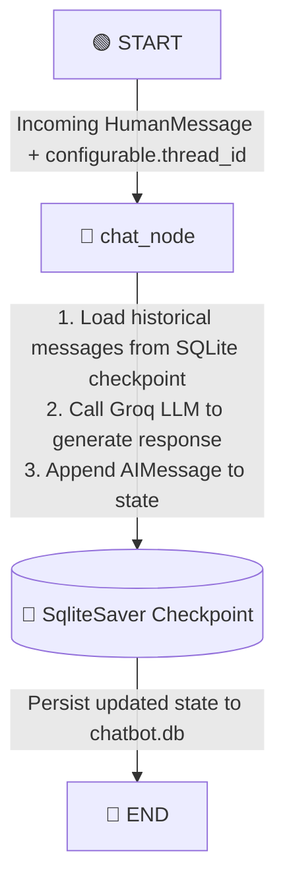
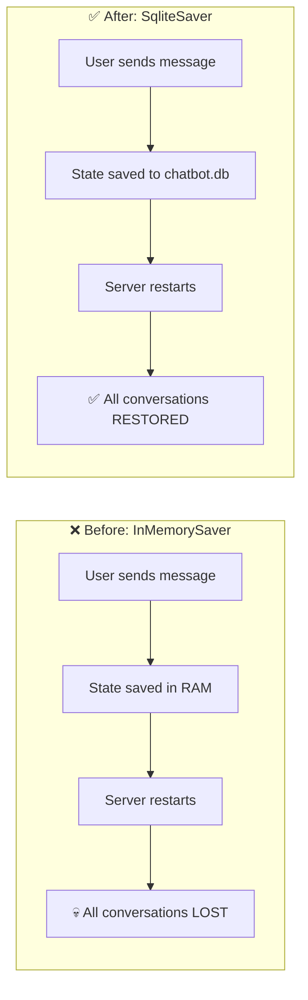
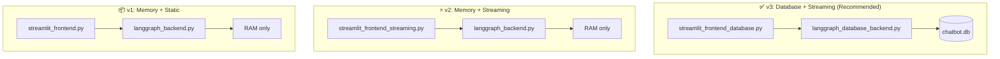

# 🧠 LangGraph ChatBot — AI Conversations That Never Forget 🤖✨

> A stateful, multi-turn conversational AI chatbot powered by **LangGraph**, **Groq (Llama 3.3 70B)**, **SQLite persistence**, and a polished **Streamlit** web UI with real-time token streaming.

---

## 🚀 Key Features

- 💾 **Persistent Chat Storage** — Conversations are saved to a local SQLite database (`chatbot.db`). Your chats survive server restarts, browser refreshes, and machine reboots.
- ⚡ **Real-Time Token Streaming** — Watch the AI think in real-time. Tokens are rendered as they arrive from Groq, with typewriter-style streaming output.
- 🔁 **Multi-Turn Memory** — The chatbot retains full context across turns using LangGraph's native checkpointing state machine.
- 📂 **Multi-Thread Conversation Switcher** — Create, switch between, and revisit past conversation threads via the sidebar — all loaded directly from the database.
- 🧠 **LangGraph State Machine** — Deterministic, graph-based dialogue management with a `StateGraph`, typed state schema, and the `add_messages` reducer.
- 🎨 **Premium Dark Mode UI** — Custom-styled Streamlit interface with branded headers, CSS injections, and a clean layout.

---

## 🧭 Project Structure & Frontend-Backend Mapping

This repository contains several versions of the same chatbot idea. In each version, the pattern is:

- the Streamlit frontend handles the user interface and sends messages to the backend,
- the backend defines the LangGraph graph, tool usage, and state handling,
- and the selected variant adds extra capabilities like streaming, persistence, MCP, RAG, or human-in-the-loop approval.

| File | Used By | Purpose |
|---|---|---|
| [1.streamlit_frontend.py](1.streamlit_frontend.py) | Basic UI | Simple Streamlit chatbot with an in-memory backend |
| [2.langgraph_backend.py](2.langgraph_backend.py) | Basic backend | Minimal LangGraph graph with no persistence |
| [3.streamlit_frontend_streaming.py](3.streamlit_frontend_streaming.py) | Streaming UI | Streamlit frontend that displays tokens as they arrive |
| [6.streamlit_frontend_database.py](6.streamlit_frontend_database.py) | Database UI | Streamlit frontend with thread switching and chat history |
| [7.langgraph_database_backend.py](7.langgraph_database_backend.py) | Database backend | LangGraph backend using SQLite persistence |
| [14.streamlit_frontend_mcp.py](14.streamlit_frontend_mcp.py) | MCP UI | Streamlit frontend for MCP-enabled tool execution |
| [13.langgraph_mcp_backend.py](13.langgraph_mcp_backend.py) | MCP backend | Backend that connects to external MCP tools |
| [17.streamlit_rag_frontend.py](17.streamlit_rag_frontend.py) | RAG UI | Streamlit frontend for retrieval-augmented generation |
| [16.langraph_rag_backend.py](16.langraph_rag_backend.py) | RAG backend | Backend using retrieval and generation flow |
| [18.chatbot_human_in_the_loop.py](18.chatbot_human_in_the_loop.py) | HITL example | Standalone example showing approval-based human control |

## 🤝 Human-in-the-Loop (HITL)

Human-in-the-loop means the AI pauses and asks a human for approval before taking a sensitive action. This is especially useful for tasks such as purchases, sending messages, changing settings, or triggering external workflows.

The example in [18.chatbot_human_in_the_loop.py](18.chatbot_human_in_the_loop.py) demonstrates this pattern:

- the `purchase_stock` tool calls `interrupt(...)`,
- the graph pauses and presents a confirmation prompt,
- the human responds with a decision such as `yes` or `no`,
- and the graph resumes using `Command(resume=decision)`.

This gives the user control over risky or important actions instead of letting the model act fully on its own.

---

## 🛠️ Tool Calling Support

The chatbot supports external tools through LangGraph's tool-calling flow. The available tools vary depending on which backend is used.

### 📦 Standard Tools (Available in Most Backends)

These tools are available in [langgraph_tool_backend.py](langgraph_tool_backend.py) and [langgraph_database_backend.py](langgraph_database_backend.py):

- **`search_tool`** (DuckDuckGo Search) — Performs a web search to help answer up-to-date questions. Powered by the `DuckDuckGoSearchRun` community tool.
- **`calculator`** — Executes arithmetic operations on two numbers. Supports:
  - Addition: `'add'`, `'+'`, `'plus'`
  - Subtraction: `'subtract'`, `'-'`, `'minus'`
  - Multiplication: `'multiply'`, `'*'`, `'times'`
  - Division: `'divide'`, `'/'`
- **`get_stock_price`** — Fetches real-time stock price information for a given ticker symbol (e.g., `AAPL`, `TSLA`) using the Alpha Vantage financial API.

### 🌐 MCP Integration & MCP Tools

#### What is MCP?

**MCP** (Model Context Protocol) is an open protocol for securely connecting language models to external tools and resources. The chatbot uses the `langchain_mcp_adapters.client.MultiServerMCPClient` to connect to multiple MCP servers and expose their tools to the LLM.

#### MCP-Enabled Backend: [langgraph_mcp_backend.py](langgraph_mcp_backend.py)

This backend integrates **MCP tools** from external servers, available through:

```python
client = MultiServerMCPClient({
    "arith": {
        "transport": "stdio",
        "command": "python3",
        "args": ["/Users/nitish/Desktop/mcp-math-server/main.py"],
    },
    "expense": {
        "transport": "streamable_http",
        "url": "https://splendid-gold-dingo.fastmcp.app/mcp"
    }
})
```

**MCP Servers in Use:**

1. **`arith` MCP Server** (Local - Stdio Transport)
   - 📍 **Transport**: Stdio (command-line based)
   - 🔧 **Tools**: Math/arithmetic operations via a local MCP server
   - ⚙️ **Configuration**: Runs Python script at `/Users/nitish/Desktop/mcp-math-server/main.py`
   - 💡 **Use Case**: Advanced mathematical computations beyond basic calculator

2. **`expense` MCP Server** (Remote - HTTP Transport)
   - 📍 **Transport**: Streamable HTTP (FastMCP)
   - 🔧 **Tools**: Expense tracking and financial management
   - 🌐 **Endpoint**: `https://splendid-gold-dingo.fastmcp.app/mcp`
   - 💡 **Use Case**: Expense tracking, budgeting, and financial queries

#### How MCP Tools Are Loaded

```python
def load_mcp_tools() -> list[BaseTool]:
    """Load all tools from configured MCP servers."""
    try:
        return run_async(client.get_tools())
    except Exception:
        return []  # Gracefully fallback if MCP unavailable

mcp_tools = load_mcp_tools()
tools = [search_tool, get_stock_price, *mcp_tools]
llm_with_tools = llm.bind_tools(tools) if tools else llm
```

#### MCP Frontend: [streamlit_frontend_mcp.py](streamlit_frontend_mcp.py)

The MCP-enabled frontend supports:
- ⚡ **Async execution** — Non-blocking MCP tool calls
- 🔄 **Real-time streaming** — Token streaming from LLM and MCP tools
- 💾 **Async SQLite persistence** — Uses `AsyncSqliteSaver` for async checkpointing
- 🧵 **Multi-thread support** — Thread-safe async operations

**Key Features:**
```python
from langgraph_mcp_backend import chatbot, retrieve_all_threads, submit_async_task

# Submit async MCP tasks
result = submit_async_task(mcp_coroutine)

# Enable streaming with MCP tools
response = await chatbot.ainvoke(
    {'messages': [HumanMessage(content=user_input)]},
    config=CONFIG
)
```

### 📊 Complete Tool Matrix

| Tool | Backend | Transport | Capability | Status |
|---|---|---|---|---|
| **search_tool** (DuckDuckGo) | Tool, Database, MCP | LangChain Community | Web search | ✅ Ready |
| **calculator** | Tool, Database | Python function | Arithmetic | ✅ Ready |
| **get_stock_price** | Tool, Database, MCP | Alpha Vantage API | Stock prices | ✅ Ready |
| **MCP: arith** | MCP only | Stdio | Advanced math | ✅ MCP-Enabled |
| **MCP: expense** | MCP only | HTTP/FastMCP | Expense tracking | ✅ MCP-Enabled |

---

## 🔀 Choosing the Right Frontend-Backend Combination

### ⭐ Recommended: Database + Streaming (v3)

**Command:**
```bash
streamlit run streamlit_frontend_database.py
```

**Best For:**
- Production deployments
- Persisting conversations
- Multi-user scenarios
- Need for thread recovery after restarts

**Includes:**
- ✅ SQLite persistence (`chatbot.db`)
- ✅ Real-time token streaming
- ✅ Multi-thread conversation switcher
- ✅ All standard tools (search, calculator, stock price)

---

### 🌐 Advanced: MCP Integration + Async

**Command:**
```bash
streamlit run streamlit_frontend_mcp.py
```

**Best For:**
- Extending chatbot with external tools (MCP servers)
- Advanced use cases requiring math servers or expense tracking
- Async/non-blocking tool execution
- Experimenting with Model Context Protocol

**Includes:**
- ✅ Async SQLite persistence
- ✅ MCP server integration (arith + expense)
- ✅ Real-time streaming
- ✅ All standard tools + MCP tools
- ⚙️ Requires MCP servers to be running

---

### 📦 Alternative: In-Memory Streaming (v2)

**Command:**
```bash
streamlit run streamlit_frontend_streaming.py
```

**Best For:**
- Testing and development
- Temporary conversations (no storage needed)
- Lower resource requirements

**Includes:**
- ✅ Real-time token streaming
- ❌ No persistence (memory-only)
- ✅ All standard tools

---

### 📝 Legacy: In-Memory Static (v1)

**Command:**
```bash
streamlit run streamlit_frontend.py
```

**Best For:**
- Understanding the basics
- Minimal UI

**Includes:**
- ❌ No streaming
- ❌ No persistence
- ❌ No tools

---

## 🛠️ Tool Calling Support

The chatbot can use external tools during a conversation through LangGraph's tool-calling flow. In [langgraph_tool_backend.py](langgraph_tool_backend.py), three tools are registered and available to the LLM:

- `search_tool` — Performs a web search using DuckDuckGo to help answer up-to-date questions.
- `calculator` — Executes arithmetic operations on two numbers, including addition, subtraction, multiplication, and division. It also understands symbols like `+`, `-`, `*`, and `/`.
- `get_stock_price` — Fetches stock price information for a given ticker symbol such as `AAPL` or `TSLA`.

When a user asks for something that needs specialized functionality, the model can decide to invoke one of these tools and use the result in its response.

## 🏗️ Architecture & Flow Diagrams

### 1️⃣ System Interaction Flow (Recommended v3: Database + Streaming)

This diagram shows the runtime wiring between the **UI** (`streamlit_frontend_database.py`) and the **SQLite-backed LangGraph backend** (`langgraph_database_backend.py`). Conversation state is checkpointed to **`chatbot.db`**:

```mermaid
flowchart LR
  U["👤 User"] -->|Sends Chat Input| UI["🖥️ streamlit_frontend_database.py\n(threads + st.write_stream)"]
  UI -->|chatbot.stream(configurable.thread_id)| BG["🧠 langgraph_database_backend.py\n(SqliteSaver checkpointer)"]
  BG -->|LLM API Request| LLM["⚡ Groq Llama 3.3 70B"]
  LLM -->|Token Stream Response| BG
  BG -->|Streams message chunks| UI
  UI -->|Displays to User| U

  BG <-.->|"Saves & Loads Thread State"| CP[("💾 chatbot.db (SQLite)")]
```

### 2️⃣ LangGraph State Machine (Backend Graph)

This diagram illustrates the internal graph execution. A single node (`chat_node`) runs, while persistence is handled transparently by the **SQLite checkpointer**:


```mermaid
flowchart TD
  START["🟢 START"] -->|"Incoming HumanMessage + configurable.thread_id"| ChatNode["🧠 chat_node"]
  ChatNode -->|"1. Load historical messages from SQLite checkpoint\n2. Call Groq LLM to generate response\n3. Append AIMessage to state"| CP[("💾 SqliteSaver Checkpoint")]
  CP -->|"Persist updated state to chatbot.db"| END_NODE["🔴 END"]
```

---

## 💡 Why SQLite? — The Problem We Solved

### ❌ The Problem: Memory-Only Storage (`InMemorySaver`)

The original version of this chatbot used LangGraph's `InMemorySaver` checkpointer. This means:

| ⚠️ Issue | 📝 What Happens |
|---|---|
| **Server restart** | All conversations are permanently lost |
| **Browser refresh** | Previous thread messages disappear from the sidebar |
| **Multiple sessions** | No way to revisit or continue past conversations |
| **Deployment** | Every deployment wipes the entire chat history |

> [!WARNING]
> With `InMemorySaver`, your chatbot has **amnesia** after every restart. The state lives only in Python process memory — once the process dies, everything is gone.

### ✅ The Solution: SQLite Database Persistence (`SqliteSaver`)

We replaced `InMemorySaver` with `SqliteSaver` from `langgraph-checkpoint-sqlite`. This writes every conversation checkpoint to a local **SQLite database file** (`chatbot.db`), which means:

| ✅ Benefit | 📝 What Changes |
|---|---|
| **Survives restarts** | Conversations persist across server restarts, machine reboots, and crashes |
| **Thread recovery** | All previous thread IDs and their full message histories are recoverable on startup |
| **Zero infrastructure** | SQLite is a single file — no external database server, no Docker, no cloud dependency |
| **Instant setup** | The database file is auto-created on first run. No migrations, no schema setup |
| **Multi-thread support** | Each conversation thread is identified by a unique `thread_id` and stored independently |

> [!IMPORTANT]
> SQLite was chosen because it is **zero-configuration**, **serverless**, and **file-based** — perfect for a local development chatbot. For production deployments with multiple concurrent users, consider upgrading to `PostgresSaver` or `AsyncSqliteSaver`.

### 🔄 Before vs. After Comparison


```mermaid
flowchart LR
  subgraph BEFORE["❌ Before: InMemorySaver"]
    direction TB
    B1["User sends message"] --> B2["State saved in RAM"]
    B2 --> B3["Server restarts"]
    B3 --> B4["💀 All conversations LOST"]
  end

  subgraph AFTER["✅ After: SqliteSaver"]
    direction TB
    A1["User sends message"] --> A2["State saved to chatbot.db"]
    A2 --> A3["Server restarts"]
    A3 --> A4["✅ All conversations RESTORED"]
  end
```

---

## 🗄️ Database Integration Deep Dive: How SQLite Persistence Works

### 1️⃣ The Role of the Checkpointer

In LangGraph, the **checkpointer** is a state persistence layer that sits between the graph execution engine and permanent storage:

- 💾 **Saving State**: Every time a graph node completes execution (like `chat_node`), the checkpointer captures a full snapshot of the current state — including the entire message history — and writes it to `chatbot.db`.
- 📖 **Loading State**: When a new query arrives with a `configurable: {thread_id: ...}` config, the checkpointer intercepts the execution, queries SQLite for the last saved state belonging to that `thread_id`, and loads it back into the graph so the LLM has complete conversational context.

> [!NOTE]
> The checkpointer is **transparent** to the graph logic. The `chat_node` function doesn't know or care whether state comes from memory or a database — it just receives messages and returns a response. This is the power of LangGraph's abstraction.

### 2️⃣ Backend SQLite Setup

In [langgraph_database_backend.py](file:///e:/Projects/Project1Demo/Langgraph-ChatBot/langgraph_database_backend.py), we establish a persistent SQLite connection and wire it into the graph compilation:

```python
import sqlite3
from langgraph.checkpoint.sqlite import SqliteSaver

# Create SQLite database connection
# check_same_thread=False allows Streamlit's multi-threaded runtime to reuse this connection
conn = sqlite3.connect(database='chatbot.db', check_same_thread=False)

# Instantiate the SQLite checkpointer
checkpointer = SqliteSaver(conn=conn)

# Compile the state graph with persistent checkpointing
chatbot = graph.compile(checkpointer=checkpointer)
```

> [!TIP]
> The `check_same_thread=False` flag is **critical** when running with Streamlit. Streamlit's execution model re-runs the script on every interaction from a different thread — without this flag, SQLite raises a `ProgrammingError`.

### 3️⃣ Retrieving Saved Threads

To populate the sidebar with all previously saved conversations on startup, we query the checkpointer for every unique `thread_id` stored in the database:

```python
def retrieve_all_threads():
    all_threads = set()
    for checkpoint in checkpointer.list(None):
        all_threads.add(checkpoint.config['configurable']['thread_id'])
    return list(all_threads)
```

### 4️⃣ Loading a Past Conversation

When the user clicks a thread in the sidebar, we retrieve its full message history directly from the SQLite checkpoint:

```python
def load_conversation(thread_id):
    state = chatbot.get_state(config={'configurable': {'thread_id': thread_id}})
    return state.values.get('messages', [])
```

### 5️⃣ The Database File: `chatbot.db`

- 📍 **Location**: Created automatically in the project root directory on first run
- 📦 **Format**: Standard SQLite3 database file
- 🗃️ **Tables**: Managed internally by `SqliteSaver` — includes `checkpoints` and `checkpoint_writes` tables
- 🔍 **Inspection**: Use the included [view_checkpoints.py](file:///e:/Projects/Project1Demo/Langgraph-ChatBot/view_checkpoints.py) utility to dump all stored threads and messages

```bash
python view_checkpoints.py
```

---

## 🧩 The `thread_id` & Multi-Conversation Frontend

In [streamlit_frontend_database.py](file:///e:/Projects/Project1Demo/Langgraph-ChatBot/streamlit_frontend_database.py), the frontend manages multiple conversation threads powered by SQLite storage:

### 1️⃣ Initializing Thread List from Database

On every app startup, the frontend populates its sidebar thread list directly from `chatbot.db` — so previous conversations are immediately available:

```python
if 'chat_threads' not in st.session_state:
    st.session_state['chat_threads'] = retrieve_all_threads()
```

### 2️⃣ Creating New Conversations

Each new conversation generates a unique UUID as its `thread_id`. This UUID becomes the key that the checkpointer uses to isolate that conversation's state in the database:

```python
def generate_thread_id():
    return uuid.uuid4()

def reset_chat():
    thread_id = generate_thread_id()
    st.session_state['thread_id'] = thread_id
    add_thread(st.session_state['thread_id'])
    st.session_state['message_history'] = []
```

### 3️⃣ Switching Between Threads

Clicking a thread button in the sidebar loads its entire message history from the database checkpoint and updates the frontend display:

```python
for thread_id in st.session_state['chat_threads']:
    if st.sidebar.button(str(thread_id)):
        st.session_state['thread_id'] = thread_id
        messages = load_conversation(thread_id)
        # Convert LangChain message objects to Streamlit display format
        temp_messages = []
        for message in messages:
            role = 'user' if isinstance(message, HumanMessage) else 'assistant'
            temp_messages.append({'role': role, 'content': message.content})
        st.session_state['message_history'] = temp_messages
```

---

## 🌊 Real-Time Streaming Output

Instead of making the user wait for the full assistant response (which can take several seconds for long answers), we stream tokens live as they are generated by Groq.

### 1️⃣ Enabling LLM-Level Streaming

The Groq Chat model is initialized with `streaming=True` to enable token-level output:

```python
llm_model = ChatGroq(model="llama-3.3-70b-versatile", streaming=True)
```

### 2️⃣ Frontend Streaming Implementation

The compiled graph is executed using `chatbot.stream(...)` with `stream_mode='messages'`, which yields `(message_chunk, metadata)` tuples as tokens arrive. Streamlit's `st.write_stream(...)` renders them with a typewriter effect:

```python
with st.chat_message('Assistant : '):
    ai_message = st.write_stream(
        message_chunk.content for message_chunk, metadata in chatbot.stream(
            {'messages': [HumanMessage(content=user_input)]},
            config=CONFIG,
            stream_mode='messages'
        )
    )
```

---

## 📁 Project Structure & Frontend-Backend Mappings

### 📋 Complete File Reference

| 📄 File | 📝 Description |
|---|---|
| [langgraph_database_backend.py](file:///e:/Projects/Project1Demo/Langgraph-ChatBot/langgraph_database_backend.py) 🗄️ | **SQLite-backed backend** — State graph with `SqliteSaver` checkpointer and `retrieve_all_threads()` query function |
| [streamlit_frontend_database.py](file:///e:/Projects/Project1Demo/Langgraph-ChatBot/streamlit_frontend_database.py) 🌊 | **Database-backed streaming frontend** *(Recommended)* — Loads past threads on launch, streams responses, saves to SQLite |
| [langgraph_backend.py](file:///e:/Projects/Project1Demo/Langgraph-ChatBot/langgraph_backend.py) 🧠 | Legacy memory-only backend using `InMemorySaver` |
| [streamlit_frontend_streaming.py](file:///e:/Projects/Project1Demo/Langgraph-ChatBot/streamlit_frontend_streaming.py) 🖥️ | Legacy memory-only streaming frontend |
| [streamlit_frontend.py](file:///e:/Projects/Project1Demo/Langgraph-ChatBot/streamlit_frontend.py) 🖥️ | Legacy memory-only static (non-streaming) frontend |
| [langgraph_tool_backend.py](file:///e:/Projects/Project1Demo/Langgraph-ChatBot/langgraph_tool_backend.py) 🔧 | Tool-enabled backend with `search_tool`, `calculator`, and `get_stock_price` tools |
| [langgraph_mcp_backend.py](file:///e:/Projects/Project1Demo/Langgraph-ChatBot/langgraph_mcp_backend.py) 🌐 | **MCP-integrated backend** — Multi-Server MCP Client with async support and external MCP tools |
| [streamlit_frontend_mcp.py](file:///e:/Projects/Project1Demo/Langgraph-ChatBot/streamlit_frontend_mcp.py) 🔌 | **MCP frontend** — Async UI for MCP-enabled chatbot with real-time MCP tool streaming |
| [streamlit_frontend_threading.py](file:///e:/Projects/Project1Demo/Langgraph-ChatBot/streamlit_frontend_threading.py) ⚙️ | Threading-based frontend for concurrent task handling |
| [view_checkpoints.py](file:///e:/Projects/Project1Demo/Langgraph-ChatBot/view_checkpoints.py) 🛠️ | Developer utility — dumps all thread checkpoints and message histories from `chatbot.db` |
| [main.py](file:///e:/Projects/Project1Demo/Langgraph-ChatBot/main.py) 📌 | Basic entry point placeholder |
| [requirements.txt](file:///e:/Projects/Project1Demo/Langgraph-ChatBot/requirements.txt) 📦 | Pip dependency list |
| [pyproject.toml](file:///e:/Projects/Project1Demo/Langgraph-ChatBot/pyproject.toml) ⚙️ | Project metadata and uv/pip dependency specification |
| [.env](file:///e:/Projects/Project1Demo/Langgraph-ChatBot/.env) 🔑 | Environment variables (API keys) — **not tracked in git** |

### 🔗 Frontend-Backend Mappings

This project provides multiple frontend-backend combinations optimized for different use cases:

| Frontend | Backend | Features | Persistence | Status |
|---|---|---|---|---|
| **[streamlit_frontend_database.py](streamlit_frontend_database.py)** | **[langgraph_database_backend.py](langgraph_database_backend.py)** | Multi-thread, streaming, tools (search, calculator, stock price) | ✅ SQLite | ⭐ **Recommended** |
| **[streamlit_frontend_streaming.py](streamlit_frontend_streaming.py)** | **[langgraph_backend.py](langgraph_backend.py)** | Streaming, basic conversation | ❌ Memory-only | Legacy |
| **[streamlit_frontend.py](streamlit_frontend.py)** | **[langgraph_backend.py](langgraph_backend.py)** | Basic conversation (no streaming) | ❌ Memory-only | Legacy |
| **[streamlit_frontend_threading.py](streamlit_frontend_threading.py)** | **[langgraph_backend.py](langgraph_backend.py)** | Threading, concurrent operations | ❌ Memory-only | Legacy |
| **[streamlit_frontend_mcp.py](streamlit_frontend_mcp.py)** | **[langgraph_mcp_backend.py](langgraph_mcp_backend.py)** | MCP tools, async, streaming, tools (search, stock price, MCP tools) | ✅ SQLite (async) | **MCP-Enabled** |

---

## 🔀 Three Frontend Modes Explained

This project ships with multiple frontend implementations, each demonstrating a different level of capability:


```mermaid
flowchart TD
  subgraph V3["✅ v3: Database + Streaming (Recommended)"]
    direction LR
    V3F["streamlit_frontend_database.py"] --> V3B["langgraph_database_backend.py"]
    V3B --> V3D[("chatbot.db")]
  end

  subgraph V2["⚡ v2: Memory + Streaming"]
    direction LR
    V2F["streamlit_frontend_streaming.py"] --> V2B["langgraph_backend.py"]
    V2B --> V2M["RAM only"]
  end

  subgraph V1["📦 v1: Memory + Static"]
    direction LR
    V1F["streamlit_frontend.py"] --> V1B["langgraph_backend.py"]
    V1B --> V1M["RAM only"]
  end
```

| Version | Frontend | Backend | Persistence | Streaming | Status |
|---|---|---|---|---|---|
| **v3** ⭐ | `streamlit_frontend_database.py` | `langgraph_database_backend.py` | ✅ SQLite | ✅ Yes | **Recommended** |
| **v2** | `streamlit_frontend_streaming.py` | `langgraph_backend.py` | ❌ RAM only | ✅ Yes | Legacy |
| **v1** | `streamlit_frontend.py` | `langgraph_backend.py` | ❌ RAM only | ❌ No | Legacy |

---

## ▶️ Setup & How to Run

### 1️⃣ Prerequisites

- 🐍 **Python 3.14+** (as specified in `pyproject.toml`)
- 🔑 A **Groq API key** — get one free at [console.groq.com](https://console.groq.com)

### 2️⃣ Install Dependencies

```bash
# Using pip
pip install -r requirements.txt

# Or using uv (recommended)
uv sync
```

### 3️⃣ Configure Environment Variables

Create a `.env` file in the project root directory:

```env
GROQ_API_KEY=your_groq_api_key_here
```

> [!CAUTION]
> Never commit your `.env` file to version control. It is already listed in `.gitignore` to prevent accidental exposure of your API keys.

### 4️⃣ Activate Virtual Environment

```bash
# Windows PowerShell
.\.venv\Scripts\Activate.ps1

# Windows Command Prompt
.\.venv\Scripts\activate.bat

# macOS / Linux
source .venv/bin/activate
```

### 5️⃣ Launch the Application

**Recommended** — Database-backed streaming version:
```bash
streamlit run streamlit_frontend_database.py
```

**Alternative** — Legacy in-memory versions:
```bash
# Streaming (memory-only)
streamlit run streamlit_frontend_streaming.py

# Static (memory-only)
streamlit run streamlit_frontend.py
```

---

## 🛠️ Developer Utilities

### 🔍 Inspect Database Contents

Use the included [view_checkpoints.py](file:///e:/Projects/Project1Demo/Langgraph-ChatBot/view_checkpoints.py) script to inspect all saved threads and their full conversation histories:

```bash
python view_checkpoints.py
```

**Example output:**
```
=== THREAD ID: a1b2c3d4-e5f6-... ===
[*] Checkpoint: ckpt_abc123
  - HUMAN: What is LangGraph?
  - AI: LangGraph is a framework for building stateful...

=== THREAD ID: f7g8h9i0-j1k2-... ===
[*] Checkpoint: ckpt_def456
  - HUMAN: Explain quantum computing
  - AI: Quantum computing leverages quantum mechanical...
```

---

## 🗺️ Roadmap & Future Improvements

- 🐘 **PostgreSQL support** — Replace SQLite with `PostgresSaver` for production multi-user deployments
- 🔐 **User authentication** — Add login/session management so threads are private per user
- 📝 **Thread naming** — Auto-generate descriptive thread names from the first message instead of showing raw UUIDs
- 🔄 **Async checkpointing** — Migrate to `AsyncSqliteSaver` for non-blocking database writes
- 📊 **Usage analytics** — Track token counts, response times, and conversation lengths
- 🧹 **Thread management** — Add ability to delete, rename, or archive old conversations

---

> Built with ❤️ using [LangGraph](https://langchain-ai.github.io/langgraph/) · [Groq](https://groq.com/) · [Streamlit](https://streamlit.io/) · [SQLite](https://www.sqlite.org/)
