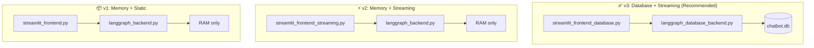

# 🧠 LangGraph ChatBot — AI Conversations That Never Forget 🤖

> A stateful, multi-turn conversational AI chatbot powered by **LangGraph**, **Groq (Llama 3.3 70B)**, **SQLite persistence**, and a polished **Streamlit** web UI with real-time token streaming.

## 📑 Quick Navigation

| Section | Purpose |
|---------|---------|
| [🚀 Key Features](#key-features) | What's included |
| [⚡ Quick Start](#quick-start) | Run in 2 minutes |
| [📋 Implementation Guide](#implementations) | Choose your variant |
| [🔧 Tools & Capabilities](#tools--capabilities) | Available functions |
| [📚 Memory Systems](#memory-systems) | STM & LTM documentation |

---

## 🚀 Key Features

- 💾 **Persistent Storage** — SQLite database saves all conversations (`chatbot.db`)
- ⚡ **Real-Time Streaming** — Tokens render as they arrive from Groq Llama 3.3 70B
- 🔁 **Multi-Turn Memory** — Full context across conversation turns
- 📂 **Thread Switcher** — Create, switch, and revisit past conversations
- 🧠 **State Machine** — LangGraph's deterministic dialogue management
- 🎨 **Polished UI** — Dark mode Streamlit interface with custom styling

---

## ⚡ Quick Start

### 🎯 Recommended: Database + Streaming (Production Ready)

```bash
# Install dependencies
pip install -r requirements.txt

# Set up environment
cp .env.example .env
# Edit .env with your Groq API key

# Run the chatbot
streamlit run streamlit_frontend_database.py
```

**Includes**: ✅ Persistence | ✅ Streaming | ✅ Tools | ✅ Thread Switcher

### 📦 Alternative Variants

| Variant | Command | Best For |
|---------|---------|----------|
| **Basic (v1)** | `streamlit run streamlit_frontend.py` | Learning basics |
| **Streaming (v2)** | `streamlit run streamlit_frontend_streaming.py` | Development, no storage |
| **Database (v3)** | `streamlit run streamlit_frontend_database.py` | 🌟 **Production** |
| **MCP (v4)** | `streamlit run streamlit_frontend_mcp.py` | External tools, advanced |
| **RAG (v5)** | `streamlit run streamlit_frontend_rag.py` | Document Q&A |
| **Human-in-Loop** | `streamlit run chatbot_human_in_the_loop.py` | Approval workflows |

---

## 📋 Implementations

### Frontend-Backend Pairs

| Frontend | Backend | Features |
|----------|---------|----------|
| `streamlit_frontend_database.py` | `langgraph_database_backend.py` | 💾 SQLite persistence, streaming, tools |
| `streamlit_frontend_streaming.py` | `langgraph_backend.py` | ⚡ Streaming only (no persistence) |
| `streamlit_frontend_mcp.py` | `langgraph_mcp_backend.py` | 🌐 MCP server tools + async |
| `streamlit_rag_frontend.py` | `langgraph_rag_backend.py` | 📚 Document retrieval |

---

## 🔧 Tools & Capabilities

### Standard Tools Available
- 🔍 **Search** — DuckDuckGo web search
- 🧮 **Calculator** — Arithmetic operations
- 📈 **Stock Price** — Real-time ticker data (Alpha Vantage)

### MCP Integration (Optional)
- 🌐 Connect external MCP servers
- 🧮 Math operations via local MCP server
- 💰 Expense tracking via HTTP MCP server

---

## 📚 Memory Systems

### Short-Term Memory (STM)
Conversation context within a single thread. See [STM_README.md](./STM_README.md) for:
- ✅ Multi-turn dialogue basics
- ✅ Token trimming strategies
- ✅ PostgreSQL persistence
- ✅ Summarization approaches

### Long-Term Memory (LTM)
Persistent user knowledge across conversations. See [LTM_README.md](./LTM_README.md) for:
- ✅ User profiles & preferences
- ✅ Semantic search with embeddings
- ✅ De-duplication strategies
- ✅ Cross-conversation context

---

## 🤝 Human-in-the-Loop (HITL)

Approve sensitive actions before execution:

```python
# In your tool
result = interrupt("Confirm purchase of 100 shares?")
# Graph pauses, waits for human approval
response = Command(resume=user_decision)
```

See [18.chatbot_human_in_the_loop.py](18.chatbot_human_in_the_loop.py) for full example.

---

## ⚙️ Architecture

### Flow Diagram

```
User (Streamlit UI)
    ↓
LangGraph State Graph
    ├─ Load message history (Checkpointer)
    ├─ Invoke LLM with context
    └─ Stream tokens in real-time
    ↓
SQLite Database (chatbot.db)
    ├─ Persist state
    └─ Enable thread recovery
```

### Why SQLite?

| Without Persistence | With SQLite |
|---|---|
| ❌ Conversations lost on restart | ✅ Full chat history preserved |
| ❌ No thread recovery | ✅ Switch between past chats |
| ❌ Single session only | ✅ Multi-user capable |

---

## 📖 Project Structure

```
.
├── streamlit_*.py          # Frontend UIs (various variants)
├── langgraph_*.py          # Backend implementations
├── requirements.txt        # Dependencies
├── chatbot.db             # SQLite database (auto-created)
├── STM_README.md          # Short-term memory guide
├── LTM_README.md          # Long-term memory guide
└── README.md              # This file
```

---

## 🔑 Environment Setup

Create `.env`:
```bash
GROQ_API_KEY=your_groq_api_key_here
# Optional for stock prices:
ALPHA_VANTAGE_API_KEY=your_alpha_vantage_key
```

---

## 📊 Decision Matrix

**Choosing Your Setup**:
- 🎓 **Learning**: Use v1 (basic) or v2 (streaming)
- 🏢 **Production**: Use v3 (database + streaming)
- 🔗 **External Tools**: Use v4 (MCP)
- 📄 **Document QA**: Use v5 (RAG)
- ✅ **Approvals**: Use HITL example

---

## 🚀 Performance Tips

- ✨ Use `trim_messages()` for long conversations (see STM_README)
- ✨ Enable de-duplication for LTM (see LTM_README)
- ✨ Use PostgreSQL instead of SQLite for multi-user (see STM_README)
- ✨ Cache embeddings for faster semantic search

---

## 📚 Additional Resources

- [LangGraph Docs](https://python.langchain.com/docs/langgraph)
- [LangChain Docs](https://python.langchain.com/)
- [Groq API Docs](https://console.groq.com)
- [Streamlit Docs](https://docs.streamlit.io/)

---

### 🌈 **Ready to Deploy? Start with v3 (Database + Streaming)!**

Questions? Check STM_README.md or LTM_README.md for detailed guides. 🧠✨


### 2️⃣ Backend SQLite Setup

In [langgraph_database_backend.py](file:///e:/Projects/Project1Demo/Langgraph-ChatBot/langgraph_database_backend.py), we establish a persistent SQLite connection and wire it into the graph compilation:

```python
import sqlite3
from langgraph.checkpoint.sqlite import SqliteSaver

# Create SQLite database connection
# check_same_thread=False allows Streamlit's multi-threaded runtime to reuse this connection
conn = sqlite3.connect(database='chatbot.db', check_same_thread=False)

# Instantiate the SQLite checkpointer
checkpointer = SqliteSaver(conn=conn)

# Compile the state graph with persistent checkpointing
chatbot = graph.compile(checkpointer=checkpointer)
```

> [!TIP]
> The `check_same_thread=False` flag is **critical** when running with Streamlit. Streamlit's execution model re-runs the script on every interaction from a different thread — without this flag, SQLite raises a `ProgrammingError`.

### 3️⃣ Retrieving Saved Threads

To populate the sidebar with all previously saved conversations on startup, we query the checkpointer for every unique `thread_id` stored in the database:

```python
def retrieve_all_threads():
    all_threads = set()
    for checkpoint in checkpointer.list(None):
        all_threads.add(checkpoint.config['configurable']['thread_id'])
    return list(all_threads)
```

### 4️⃣ Loading a Past Conversation

When the user clicks a thread in the sidebar, we retrieve its full message history directly from the SQLite checkpoint:

```python
def load_conversation(thread_id):
    state = chatbot.get_state(config={'configurable': {'thread_id': thread_id}})
    return state.values.get('messages', [])
```

### 5️⃣ The Database File: `chatbot.db`

- 📍 **Location**: Created automatically in the project root directory on first run
- 📦 **Format**: Standard SQLite3 database file
- 🗃️ **Tables**: Managed internally by `SqliteSaver` — includes `checkpoints` and `checkpoint_writes` tables
- 🔍 **Inspection**: Use the included [view_checkpoints.py](file:///e:/Projects/Project1Demo/Langgraph-ChatBot/view_checkpoints.py) utility to dump all stored threads and messages

```bash
python view_checkpoints.py
```

---

## 🧩 The `thread_id` & Multi-Conversation Frontend

In [streamlit_frontend_database.py](file:///e:/Projects/Project1Demo/Langgraph-ChatBot/streamlit_frontend_database.py), the frontend manages multiple conversation threads powered by SQLite storage:

### 1️⃣ Initializing Thread List from Database

On every app startup, the frontend populates its sidebar thread list directly from `chatbot.db` — so previous conversations are immediately available:

```python
if 'chat_threads' not in st.session_state:
    st.session_state['chat_threads'] = retrieve_all_threads()
```

### 2️⃣ Creating New Conversations

Each new conversation generates a unique UUID as its `thread_id`. This UUID becomes the key that the checkpointer uses to isolate that conversation's state in the database:

```python
def generate_thread_id():
    return uuid.uuid4()

def reset_chat():
    thread_id = generate_thread_id()
    st.session_state['thread_id'] = thread_id
    add_thread(st.session_state['thread_id'])
    st.session_state['message_history'] = []
```

### 3️⃣ Switching Between Threads

Clicking a thread button in the sidebar loads its entire message history from the database checkpoint and updates the frontend display:

```python
for thread_id in st.session_state['chat_threads']:
    if st.sidebar.button(str(thread_id)):
        st.session_state['thread_id'] = thread_id
        messages = load_conversation(thread_id)
        # Convert LangChain message objects to Streamlit display format
        temp_messages = []
        for message in messages:
            role = 'user' if isinstance(message, HumanMessage) else 'assistant'
            temp_messages.append({'role': role, 'content': message.content})
        st.session_state['message_history'] = temp_messages
```

---

## 🌊 Real-Time Streaming Output

Instead of making the user wait for the full assistant response (which can take several seconds for long answers), we stream tokens live as they are generated by Groq.

### 1️⃣ Enabling LLM-Level Streaming

The Groq Chat model is initialized with `streaming=True` to enable token-level output:

```python
llm_model = ChatGroq(model="llama-3.3-70b-versatile", streaming=True)
```

### 2️⃣ Frontend Streaming Implementation

The compiled graph is executed using `chatbot.stream(...)` with `stream_mode='messages'`, which yields `(message_chunk, metadata)` tuples as tokens arrive. Streamlit's `st.write_stream(...)` renders them with a typewriter effect:

```python
with st.chat_message('Assistant : '):
    ai_message = st.write_stream(
        message_chunk.content for message_chunk, metadata in chatbot.stream(
            {'messages': [HumanMessage(content=user_input)]},
            config=CONFIG,
            stream_mode='messages'
        )
    )
```

---

## 📁 Project Structure & Frontend-Backend Mappings

### 📋 Complete File Reference

| 📄 File | 📝 Description |
|---|---|
| [langgraph_database_backend.py](file:///e:/Projects/Project1Demo/Langgraph-ChatBot/langgraph_database_backend.py) 🗄️ | **SQLite-backed backend** — State graph with `SqliteSaver` checkpointer and `retrieve_all_threads()` query function |
| [streamlit_frontend_database.py](file:///e:/Projects/Project1Demo/Langgraph-ChatBot/streamlit_frontend_database.py) 🌊 | **Database-backed streaming frontend** *(Recommended)* — Loads past threads on launch, streams responses, saves to SQLite |
| [langgraph_backend.py](file:///e:/Projects/Project1Demo/Langgraph-ChatBot/langgraph_backend.py) 🧠 | Legacy memory-only backend using `InMemorySaver` |
| [streamlit_frontend_streaming.py](file:///e:/Projects/Project1Demo/Langgraph-ChatBot/streamlit_frontend_streaming.py) 🖥️ | Legacy memory-only streaming frontend |
| [streamlit_frontend.py](file:///e:/Projects/Project1Demo/Langgraph-ChatBot/streamlit_frontend.py) 🖥️ | Legacy memory-only static (non-streaming) frontend |
| [langgraph_tool_backend.py](file:///e:/Projects/Project1Demo/Langgraph-ChatBot/langgraph_tool_backend.py) 🔧 | Tool-enabled backend with `search_tool`, `calculator`, and `get_stock_price` tools |
| [langgraph_mcp_backend.py](file:///e:/Projects/Project1Demo/Langgraph-ChatBot/langgraph_mcp_backend.py) 🌐 | **MCP-integrated backend** — Multi-Server MCP Client with async support and external MCP tools |
| [streamlit_frontend_mcp.py](file:///e:/Projects/Project1Demo/Langgraph-ChatBot/streamlit_frontend_mcp.py) 🔌 | **MCP frontend** — Async UI for MCP-enabled chatbot with real-time MCP tool streaming |
| [streamlit_frontend_threading.py](file:///e:/Projects/Project1Demo/Langgraph-ChatBot/streamlit_frontend_threading.py) ⚙️ | Threading-based frontend for concurrent task handling |
| [view_checkpoints.py](file:///e:/Projects/Project1Demo/Langgraph-ChatBot/view_checkpoints.py) 🛠️ | Developer utility — dumps all thread checkpoints and message histories from `chatbot.db` |
| [main.py](file:///e:/Projects/Project1Demo/Langgraph-ChatBot/main.py) 📌 | Basic entry point placeholder |
| [requirements.txt](file:///e:/Projects/Project1Demo/Langgraph-ChatBot/requirements.txt) 📦 | Pip dependency list |
| [pyproject.toml](file:///e:/Projects/Project1Demo/Langgraph-ChatBot/pyproject.toml) ⚙️ | Project metadata and uv/pip dependency specification |
| [.env](file:///e:/Projects/Project1Demo/Langgraph-ChatBot/.env) 🔑 | Environment variables (API keys) — **not tracked in git** |

### 🔗 Frontend-Backend Mappings

This project provides multiple frontend-backend combinations optimized for different use cases:

| Frontend | Backend | Features | Persistence | Status |
|---|---|---|---|---|
| **[streamlit_frontend_database.py](streamlit_frontend_database.py)** | **[langgraph_database_backend.py](langgraph_database_backend.py)** | Multi-thread, streaming, tools (search, calculator, stock price) | ✅ SQLite | ⭐ **Recommended** |
| **[streamlit_frontend_streaming.py](streamlit_frontend_streaming.py)** | **[langgraph_backend.py](langgraph_backend.py)** | Streaming, basic conversation | ❌ Memory-only | Legacy |
| **[streamlit_frontend.py](streamlit_frontend.py)** | **[langgraph_backend.py](langgraph_backend.py)** | Basic conversation (no streaming) | ❌ Memory-only | Legacy |
| **[streamlit_frontend_threading.py](streamlit_frontend_threading.py)** | **[langgraph_backend.py](langgraph_backend.py)** | Threading, concurrent operations | ❌ Memory-only | Legacy |
| **[streamlit_frontend_mcp.py](streamlit_frontend_mcp.py)** | **[langgraph_mcp_backend.py](langgraph_mcp_backend.py)** | MCP tools, async, streaming, tools (search, stock price, MCP tools) | ✅ SQLite (async) | **MCP-Enabled** |

---

## 🔀 Three Frontend Modes Explained

This project ships with multiple frontend implementations, each demonstrating a different level of capability:


```mermaid
flowchart TD
  subgraph V3["✅ v3: Database + Streaming (Recommended)"]
    direction LR
    V3F["streamlit_frontend_database.py"] --> V3B["langgraph_database_backend.py"]
    V3B --> V3D[("chatbot.db")]
  end

  subgraph V2["⚡ v2: Memory + Streaming"]
    direction LR
    V2F["streamlit_frontend_streaming.py"] --> V2B["langgraph_backend.py"]
    V2B --> V2M["RAM only"]
  end

  subgraph V1["📦 v1: Memory + Static"]
    direction LR
    V1F["streamlit_frontend.py"] --> V1B["langgraph_backend.py"]
    V1B --> V1M["RAM only"]
  end
```

| Version | Frontend | Backend | Best For |
|---------|----------|---------|----------|
| **v3** 🌟 | `streamlit_frontend_database.py` | `langgraph_database_backend.py` | Production, persistence |
| **v2** | `streamlit_frontend_streaming.py` | `langgraph_backend.py` | Development |
| **v1** | `streamlit_frontend.py` | `langgraph_backend.py` | Learning |

---

## 📋 Installation

### Prerequisites
- 🐍 Python 3.14+
- 🔑 Groq API key (free at [console.groq.com](https://console.groq.com))

### Quick Setup

```bash
# 1. Install dependencies
pip install -r requirements.txt

# 2. Create .env file
echo "GROQ_API_KEY=your_key_here" > .env

# 3. Run the app
streamlit run streamlit_frontend_database.py
```

---

## � Inspecting Saved Conversations

View all saved threads and their message history:

```bash
python view_checkpoints.py
```

---

## 📖 Learn More

- [LangGraph Documentation](https://python.langchain.com/docs/langgraph)
- [Groq API Reference](https://console.groq.com/docs)
- [Streamlit Guide](https://docs.streamlit.io)

---

**Built with ❤️ using LangGraph • Groq • Streamlit • SQLite**
